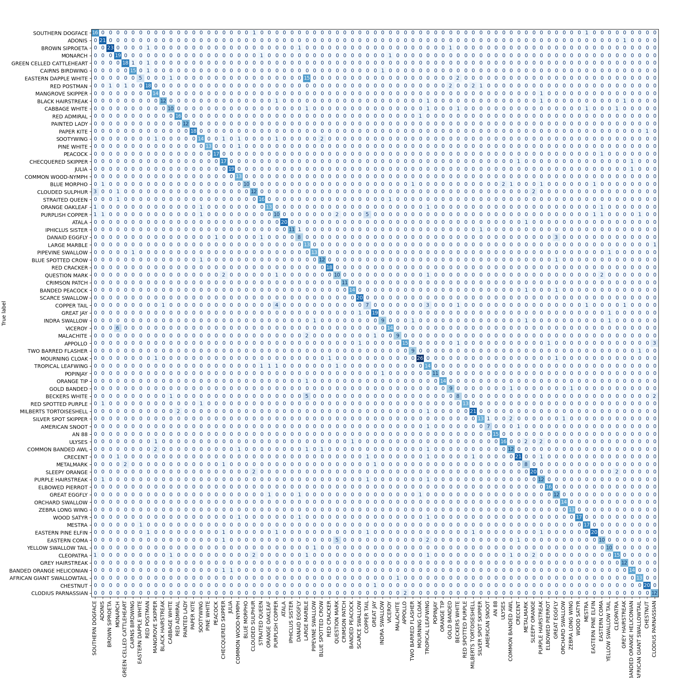

# Butterfly Image Classification
In this project, we implement a convolutional neural network to classify images of butterflies by species.

## The Dataset

Our data set consists of 6499 RGB images of size 224 x 224, each of which depicts a butterfly of one of 75 possible species. We can see a few of our images together with their species label below.

## Data Augmentation

In order to optimize the performance of our image classifier, we apply data augmentation techniques. More precisely, during our training, we apply a variety of geometric transformations to our input images before passing them through the model. The effect of these transformations can be seen for a few images below.

This has the effect of artificially increasing the size of our training set. This improves the ability of our model to accurately predict the species of previously unseen images. 

## Constructing and Training our Model

We implement a convolutional neural network consisting of 8 convolutional layers, followed by a single fully connected layer.  Each convolutional layer consists of 4 parts:

1. A convolution operation, which applies a collection of (number of output channels) convolution kernels of size (number of input channels)x5x5 to the input.
2. A batch norm, which normalizes the output data of the convolutional layer.
3. A (non-linear) activation function, namely the rectified linear unit ReLU, which acts by x -> max(x,0).
4. Finally, we apply a 2-dimensional maxpool, which reduces the outputs image by a factor of 2 in each dimension. Doing this allows us to capture both large and small scale patters in the images. 

Passing a 3 x 224 x 224 image tensor through these first 8 layers produces a 1-dimensional output tensor of length 512. We use a fully connected layer at the end to convert this tensor of length 512 to a tensor of length 75, corresponding to the 75 possible species. We depict our network architecture in the following diagram.

After constructing our model, we train our model on our training set of 5199 labelled butterfly images, for 100 epochs. 

## Performance Analysis and Conclusions

We achieve an accuracy of about 83% on our testing set. The predictions from our training set can be visualized in the following confusion matrix.

We see that most of our models errors occur for a few species. For instance, our model often confuses the species 'Eastern Coma' and 'Question Mark', as well as the species 'Large Marble' and 'Eastern Dapple White'. By taking a look at images of these species, we see that these are nearly indisinguishable to the non-expert. 

